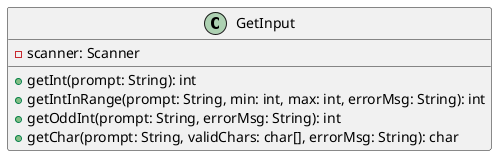
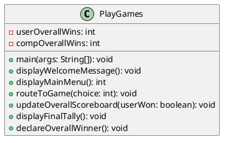
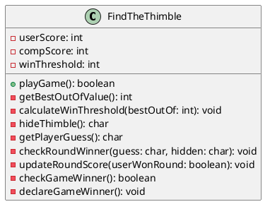
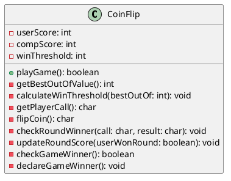
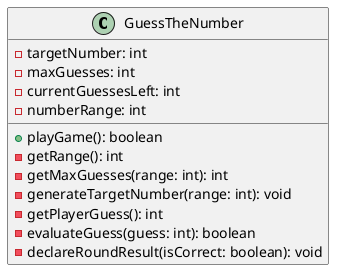
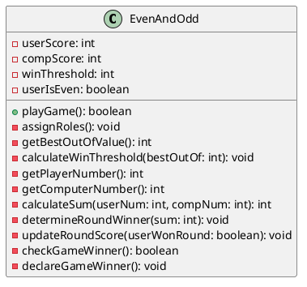
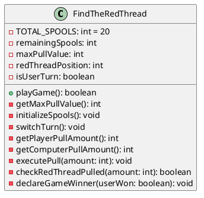

# Code Design
### `GetInput`

```plantuml
@startuml
class GetInput {
  - scanner: Scanner
  
  + getInt(prompt: String): int
  + getIntInRange(prompt: String, min: int, max: int, errorMsg: String): int
  + getOddInt(prompt: String, errorMsg: String): int
  + getChar(prompt: String, validChars: char[], errorMsg: String): char
}
@enduml
```

### `PlayGames`

```plantuml
@startuml
class PlayGames {
  - userOverallWins: int
  - compOverallWins: int
  
  + main(args: String[]): void
  + displayWelcomeMessage(): void
  + displayMainMenu(): int
  + routeToGame(choice: int): void
  + updateOverallScoreboard(userWon: boolean): void
  + displayFinalTally(): void
  + declareOverallWinner(): void
}
@enduml
```

### `FindTheThimble`

```plantuml
@startuml
class FindTheThimble {
  - userScore: int
  - compScore: int
  - winThreshold: int
  
  + playGame(): boolean
  - getBestOutOfValue(): int
  - calculateWinThreshold(bestOutOf: int): void
  - hideThimble(): char
  - getPlayerGuess(): char
  - checkRoundWinner(guess: char, hidden: char): void
  - updateRoundScore(userWonRound: boolean): void
  - checkGameWinner(): boolean
  - declareGameWinner(): void
}
@enduml
```

### `CoinFlip`

```plantuml
@startuml
class CoinFlip {
  - userScore: int
  - compScore: int
  - winThreshold: int
  
  + playGame(): boolean
  - getBestOutOfValue(): int
  - calculateWinThreshold(bestOutOf: int): void
  - getPlayerCall(): char
  - flipCoin(): char
  - checkRoundWinner(call: char, result: char): void
  - updateRoundScore(userWonRound: boolean): void
  - checkGameWinner(): boolean
  - declareGameWinner(): void
}
@enduml
```

### `GuessTheNumber`

```plantuml
@startuml
class GuessTheNumber {
  - targetNumber: int
  - maxGuesses: int
  - currentGuessesLeft: int
  - numberRange: int
  
  + playGame(): boolean
  - getRange(): int
  - getMaxGuesses(range: int): int
  - generateTargetNumber(range: int): void
  - getPlayerGuess(): int
  - evaluateGuess(guess: int): boolean
  - declareRoundResult(isCorrect: boolean): void
}
@enduml
```

### `EvenAndOdd`

```plantuml
@startuml
class EvenAndOdd {
  - userScore: int
  - compScore: int
  - winThreshold: int
  - userIsEven: boolean
  
  + playGame(): boolean
  - assignRoles(): void
  - getBestOutOfValue(): int
  - calculateWinThreshold(bestOutOf: int): void
  - getPlayerNumber(): int
  - getComputerNumber(): int
  - calculateSum(userNum: int, compNum: int): int
  - determineRoundWinner(sum: int): void
  - updateRoundScore(userWonRound: boolean): void
  - checkGameWinner(): boolean
  - declareGameWinner(): void
}
@enduml
```

### `FindTheRedThread`

```plantuml
@startuml
class FindTheRedThread {
  - TOTAL_SPOOLS: int = 20
  - remainingSpools: int
  - maxPullValue: int
  - redThreadPosition: int
  - isUserTurn: boolean
  
  + playGame(): boolean
  - getMaxPullValue(): int
  - initializeSpools(): void
  - switchTurn(): void
  - getPlayerPullAmount(): int
  - getComputerPullAmount(): int
  - executePull(amount: int): void
  - checkRedThreadPulled(amount: int): boolean
  - declareGameWinner(userWon: boolean): void
}
@enduml
```