# Code Design

### `GetInput`

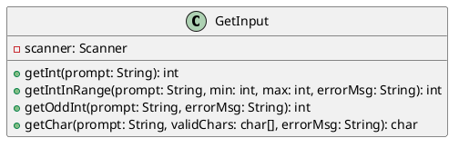

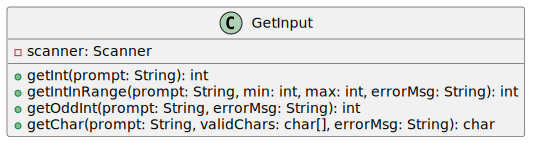

#### Method Glossary

`public int` **getInt** `(String)`
- **param1:** String, accepting the prompt to display to the user.
- **return:** integer, representing a valid numeric input.
- **purpose:** Prompts the user for an integer, catches exceptions to prevent crashes, and returns the valid integer.

`public int` **getIntInRange** `(String, int, int, String)`
- **param1:** String, prompt to display to the user.
- **param2:** integer, minimum acceptable value.
- **param3:** integer, maximum acceptable value.
- **param4:** String, error message for invalid input.
- **return:** integer, validated number within bounds.
- **purpose:** Prompts the user for a number, looping until the input falls inclusively between the min and max parameters.

`public int` **getOddInt** `(String, String)`
- **param1:** String, prompt to display to the user.
- **param2:** String, error message.
- **return:** integer, validated odd number.
- **purpose:** Accepts an integer, verifying it is odd, looping if the user provides an even number.

`public char` **getChar** `(String, char[], String)`
- **param1:** String, prompt to display to the user.
- **param2:** char array, specific valid characters allowed.
- **param3:** String, error message.
- **return:** char, validated user selection.
- **purpose:** Prompts the user, reads the character, and validates it against the provided array.

#### Data Configuration Table

| Value & Variable | Input Format | Output Type/Format | Internal Representation |
| --- | --- | --- | --- |
| Valid character set, **validChars** | N/A | Displayed in prompt (e.g., "[H, T]") | `char[]` |

#### Unit Tests

| **Class/Method** | **Purpose** | **Test Steps** | **Expected Result** | **Actual Result** | **Passed** | **Failed** |
| --- | --- | --- | --- | --- | --- | --- |
| GetInput/getInt | Returns valid integer when input is numeric | Call method; enter "5" | Returns 5 | Returns 5 | X | |
| GetInput/getInt | Re-prompts on non-numeric input | Call method; enter "abc", then "3" | Re-prompts; returns 3 | Re-prompts; returns 3 | X | |
| GetInput/getIntInRange | Returns integer within specified range | Call with min=1, max=6; enter "4" | Returns 4 | Returns 4 | X | |
| GetInput/getIntInRange | Rejects integer below range | Call with min=1, max=6; enter "0", then "2" | Re-prompts; returns 2 | Re-prompts; returns 2 | X | |
| GetInput/getIntInRange | Rejects integer above range | Call with min=1, max=6; enter "9", then "3" | Re-prompts; returns 3 | Re-prompts; returns 3 | X | |
| GetInput/getIntInRange | Rejects non-numeric input | Call with min=1, max=6; enter "abc", then "2" | Re-prompts; returns 2 | Re-prompts; returns 2 | X | |
| GetInput/getOddInt | Returns valid odd integer | Call method; enter "5" | Returns 5 | Returns 5 | X | |
| GetInput/getOddInt | Rejects even integer | Call method; enter "4", then "3" | Re-prompts; returns 3 | Re-prompts; returns 3 | X | |
| GetInput/getOddInt | Rejects non-numeric input | Call method; enter "abc", then "7" | Re-prompts; returns 7 | Re-prompts; returns 7 | X | |
| GetInput/getChar | Returns valid character from set | Call with validChars=['H','T']; enter "H" | Returns 'H' | Returns 'H' | X | |
| GetInput/getChar | Rejects character not in valid set | Call with validChars=['H','T']; enter "W", then "T" | Re-prompts; returns 'T' | Re-prompts; returns 'T' | X | |
| GetInput/getChar | Rejects lowercase when set is uppercase | Call with validChars=['H','T']; enter "h", then "H" | Re-prompts; returns 'H' | Re-prompts; returns 'H' | X | |

---

### `PlayGames`

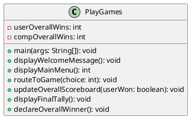

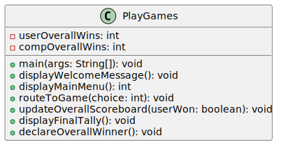

#### Method Glossary

`public static void` **main** `(String[])`
- **param1:** String array, command line arguments.
- **return:** void
- **purpose:** The primary entry point of the program. Checks for the `--test` flag, drives the main game selection loop, and triggers the final tally on exit.

`public void` **displayWelcomeMessage** `()`
- **return:** void
- **purpose:** Prints the initial "Game of Games" welcome banner to the console.

`public int` **displayMainMenu** `()`
- **return:** integer, menu choice between 1 and 6.
- **purpose:** Displays the 1–6 menu options and returns the user's validated selection.

`public void` **routeToGame** `(int)`
- **param1:** integer, representing the menu selection.
- **return:** void
- **purpose:** Routes the user to the correct mini-game class based on their menu choice.

`public void` **updateOverallScoreboard** `(boolean)`
- **param1:** boolean, indicating if the user won the preceding game.
- **return:** void
- **purpose:** Increments the overall session score and prints the updated tally.

`public void` **displayFinalTally** `()`
- **return:** void
- **purpose:** Displays the final accumulated scores upon quitting.

`public void` **declareOverallWinner** `()`
- **return:** void
- **purpose:** Evaluates the final scores and prints the ultimate winner of the session.

#### Data Configuration Table

| Value & Variable | Input Format | Output Type/Format | Internal Representation |
| --- | --- | --- | --- |
| Main menu selection, **choice** | Integer (1–6) | N/A | `int` |
| Overall session scores, **userOverallWins**, **compOverallWins** | N/A | Integer values shown on final tally | `int` |

#### Unit Tests

| **Class/Method** | **Purpose** | **Test Steps** | **Expected Result** | **Actual Result** | **Passed** | **Failed** |
| --- | --- | --- | --- | --- | --- | --- |
| PlayGames/routeToGame | Routes choice 1 to GuessTheNumber | Call routeToGame(1) | GuessTheNumber game initiates | GuessTheNumber game initiates | X | |
| PlayGames/routeToGame | Routes choice 4 to FindTheThimble | Call routeToGame(4) | FindTheThimble game initiates | FindTheThimble game initiates | X | |
| PlayGames/displayMainMenu | Accepts valid menu selection | Enter "1" at menu prompt | Returns 1 | Returns 1 | X | |
| PlayGames/displayMainMenu | Rejects out-of-range numeric input | Enter "9" at menu prompt | Error message displayed; re-prompted | Error message displayed; re-prompted | X | |
| PlayGames/displayMainMenu | Rejects non-numeric input | Enter "W" at menu prompt | Error message displayed; re-prompted | Error message displayed; re-prompted | X | |
| PlayGames/main | Input 6 exits loop and calls displayFinalTally | Enter "6" at menu | System exits menu; proceeds to Final Tally | System exits menu; proceeds to Final Tally | X | |
| PlayGames/displayFinalTally | Displays total wins and losses for both players | After quitting with recorded wins/losses; call displayFinalTally | Total wins and losses displayed for User and Computer | Total wins and losses displayed for User and Computer | X | |
| PlayGames/declareOverallWinner | Declares user as winner when user has more wins | Set userOverallWins > compOverallWins; call declareOverallWinner | Message naming User as "Winner of the Game of Games" | Message naming User as "Winner of the Game of Games" | X | |
| PlayGames/declareOverallWinner | Declares computer as winner when computer has more wins | Set compOverallWins > userOverallWins; call declareOverallWinner | Message naming Computer as "Winner of the Game of Games" | Message naming Computer as "Winner of the Game of Games" | X | |
| PlayGames/declareOverallWinner | Declares draw when wins are equal | Set userOverallWins == compOverallWins; call declareOverallWinner | "The Game of Games ends in a draw!" displayed | "The Game of Games ends in a draw!" displayed | X | |

---

### `FindTheThimble`

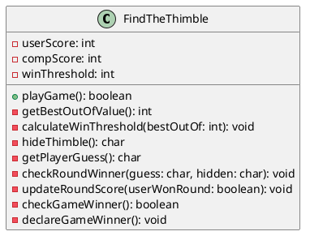

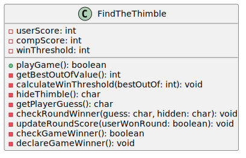

#### Method Glossary

`public boolean` **playGame** `()`
- **return:** boolean, returning true if the user wins the game, false if the computer wins.
- **purpose:** Controls the main execution loop for the mini-game.

`private int` **getBestOutOfValue** `()`
- **return:** integer, the best-out-of value.
- **purpose:** Prompts the user for the odd number of rounds to play.

`private void` **calculateWinThreshold** `(int)`
- **param1:** integer, the best-out-of odd value.
- **return:** void
- **purpose:** Calculates the required wins to end the game: `(bestOutOf + 1) / 2`.

`private char` **hideThimble** `()`
- **return:** char, representing 'L' or 'R'.
- **purpose:** Randomly selects the hand the thimble is hidden in.

`private char` **getPlayerGuess** `()`
- **return:** char, representing 'L' or 'R'.
- **purpose:** Prompts the user to guess a hand.

`private void` **checkRoundWinner** `(char, char)`
- **param1:** char, the user's guess.
- **param2:** char, the actual hidden location.
- **return:** void
- **purpose:** Compares the parameters, outputs the result, and calls `updateRoundScore`.

`private void` **updateRoundScore** `(boolean)`
- **param1:** boolean, true if the user won the round.
- **return:** void
- **purpose:** Increments the appropriate round score.

`private boolean` **checkGameWinner** `()`
- **return:** boolean
- **purpose:** Checks if either player has reached the `winThreshold`.

`private void` **declareGameWinner** `()`
- **return:** void
- **purpose:** Prints the final winner of the mini-game.

#### Data Configuration Table

| Value & Variable | Input Format | Output Type/Format | Internal Representation |
| --- | --- | --- | --- |
| Best-out-of rounds, **bestOutOf** | Odd integer | N/A | `int` |
| User hand guess, **guess** | Character 'L' or 'R' | N/A | `char` |
| Hidden thimble location, **hidden** | N/A | Revealed in text ("Right" / "Left") | `char` ('L' or 'R') |
| Win threshold limit, **winThreshold** | N/A | N/A | `int` (calculated as `(bestOutOf + 1) / 2`) |
| Round score tracker, **userScore**, **compScore** | N/A | String ("You: [x], Computer: [y]") | `int` |

#### Unit Tests

| **Class/Method** | **Purpose** | **Test Steps** | **Expected Result** | **Actual Result** | **Passed** | **Failed** |
| --- | --- | --- | --- | --- | --- | --- |
| FindTheThimble/getBestOutOfValue | Accepts valid odd best-of value; threshold calculated correctly | Enter "5" | Win threshold set to 3; round 1 begins | Win threshold set to 3; round 1 begins | X | |
| FindTheThimble/getBestOutOfValue | Rejects even input | Enter "4" | "Invalid entry. The value must be an odd whole number. Please try again:" Re-prompted | "Invalid entry. The value must be an odd whole number. Please try again:" Re-prompted | X | |
| FindTheThimble/getBestOutOfValue | Rejects non-numeric input | Enter "abc" | "Invalid entry. The value must be an odd whole number. Please try again:" Re-prompted | "Invalid entry. The value must be an odd whole number. Please try again:" Re-prompted | X | |
| FindTheThimble/getPlayerGuess | Rejects invalid guess character | Enter "X" | "Invalid input. Please enter L for left or R for right:" Re-prompted | "Invalid input. Please enter L for left or R for right:" Re-prompted | X | |
| FindTheThimble/getPlayerGuess | Rejects lowercase input | Enter "l" | "Invalid input. Please enter L for left or R for right:" Re-prompted | "Invalid input. Please enter L for left or R for right:" Re-prompted | X | |
| FindTheThimble/checkRoundWinner | User wins round on correct right-hand guess | Force thimble to 'R'; enter "R" | "Correct! You win this round." Score: You 1, Computer 0 | "Correct! You win this round." Score: You 1, Computer 0 | X | |
| FindTheThimble/checkRoundWinner | User wins round on correct left-hand guess | Force thimble to 'L'; enter "L" | "Correct! You win this round." Score updated | "Correct! You win this round." Score updated | X | |
| FindTheThimble/checkRoundWinner | Computer wins round on incorrect guess | Force thimble to 'R'; enter "L" | "Wrong! The computer wins this round." Score: You 0, Computer 1 | "Wrong! The computer wins this round." Score: You 0, Computer 1 | X | |
| FindTheThimble/declareGameWinner | Declares user winner on reaching threshold | Force user to win 3 rounds in best-of-5 | "You win Find the Thimble!" Game scoreboard updated | "You win Find the Thimble!" Game scoreboard updated | X | |
| FindTheThimble/declareGameWinner | Declares computer winner on reaching threshold | Allow computer to win 3 rounds in best-of-5 | "The computer wins Find the Thimble!" Game scoreboard updated | "The computer wins Find the Thimble!" Game scoreboard updated | X | |

---

### `CoinFlip`

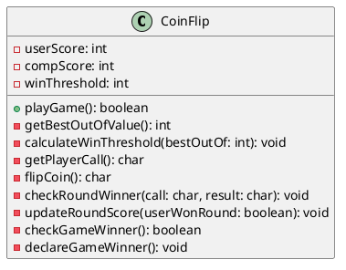

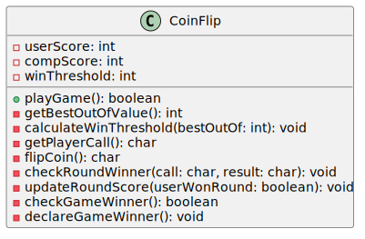

#### Method Glossary

`public boolean` **playGame** `()`
- **return:** boolean, returning true if the user wins the game.
- **purpose:** Controls the execution loop for Coin Flip.

`private int` **getBestOutOfValue** `()`
- **return:** integer, the best-out-of value.
- **purpose:** Prompts the user for the odd number of rounds.

`private void` **calculateWinThreshold** `(int)`
- **param1:** integer, the best-out-of odd value.
- **return:** void
- **purpose:** Calculates the required wins: `(bestOutOf + 1) / 2`.

`private char` **getPlayerCall** `()`
- **return:** char, representing 'H' or 'T'.
- **purpose:** Prompts the user to call heads or tails.

`private char` **flipCoin** `()`
- **return:** char, representing 'H' or 'T'.
- **purpose:** Randomly generates the coin flip result.

`private void` **checkRoundWinner** `(char, char)`
- **param1:** char, the user's call.
- **param2:** char, the flip result.
- **return:** void
- **purpose:** Compares the call to the flip, outputs the result, and calls `updateRoundScore`.

`private void` **updateRoundScore** `(boolean)`
- **param1:** boolean, true if the user won the round.
- **return:** void
- **purpose:** Increments the score.

`private boolean` **checkGameWinner** `()`
- **return:** boolean
- **purpose:** Evaluates if the `winThreshold` is met.

`private void` **declareGameWinner** `()`
- **return:** void
- **purpose:** Prints the game winner.

#### Data Configuration Table

| Value & Variable | Input Format | Output Type/Format | Internal Representation |
| --- | --- | --- | --- |
| Best-out-of rounds, **bestOutOf** | Odd integer | N/A | `int` |
| User coin call, **call** | Character 'H' or 'T' | N/A | `char` |
| Coin flip result, **result** | N/A | String (e.g., "The coin landed on: Heads.") | `char` ('H' or 'T') |
| Win threshold limit, **winThreshold** | N/A | N/A | `int` (calculated as `(bestOutOf + 1) / 2`) |
| Round score tracker, **userScore**, **compScore** | N/A | String ("You: [x], Computer: [y]") | `int` |

#### Unit Tests

| **Class/Method** | **Purpose** | **Test Steps** | **Expected Result** | **Actual Result** | **Passed** | **Failed** |
| --- | --- | --- | --- | --- | --- | --- |
| CoinFlip/getBestOutOfValue | Accepts valid odd best-of value; threshold calculated correctly | Enter "7" | Win threshold set to 4; round 1 begins; user prompted for H or T | Win threshold set to 4; round 1 begins; user prompted for H or T | X | |
| CoinFlip/getBestOutOfValue | Rejects even input | Enter "6" | "Invalid entry. The value must be an odd whole number. Please try again:" Re-prompted | "Invalid entry. The value must be an odd whole number. Please try again:" Re-prompted | X | |
| CoinFlip/getBestOutOfValue | Rejects non-integer input | Enter "3.5" | "Invalid entry. The value must be an odd whole number. Please try again:" Re-prompted | "Invalid entry. The value must be an odd whole number. Please try again:" Re-prompted | X | |
| CoinFlip/getPlayerCall | Rejects invalid call character | Enter "W" | "Invalid input. Please enter H for heads or T for tails:" Re-prompted | "Invalid input. Please enter H for heads or T for tails:" Re-prompted | X | |
| CoinFlip/getPlayerCall | Rejects lowercase input | Enter "h" | "Invalid input. Please enter H for heads or T for tails:" Re-prompted | "Invalid input. Please enter H for heads or T for tails:" Re-prompted | X | |
| CoinFlip/checkRoundWinner | User wins round on correct heads call | Force coin to 'H'; enter "H" | "Correct call! You win this round." Score updated | "Correct call! You win this round." Score updated | X | |
| CoinFlip/checkRoundWinner | User wins round on correct tails call | Force coin to 'T'; enter "T" | "Correct call! You win this round." Score updated | "Correct call! You win this round." Score updated | X | |
| CoinFlip/checkRoundWinner | Computer wins round on incorrect call | Force coin to 'T'; enter "H" | "Wrong call! The computer wins this round." Score updated | "Wrong call! The computer wins this round." Score updated | X | |
| CoinFlip/flipCoin | Coin result displayed before round winner is announced | Force coin to 'H'; call flipCoin then checkRoundWinner | "The coin landed on: Heads." shown before result announcement | "The coin landed on: Heads." shown before result announcement | X | |
| CoinFlip/declareGameWinner | Declares user winner on reaching threshold | Force user to win 4 rounds in best-of-7 | "You win Coin Flip!" Scoreboard updated | "You win Coin Flip!" Scoreboard updated | X | |

---

### `GuessTheNumber`

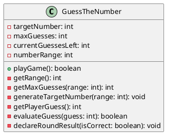

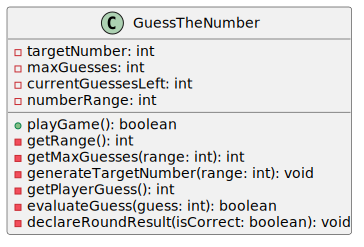

#### Method Glossary

`public boolean` **playGame** `()`
- **return:** boolean, returning true if the user wins.
- **purpose:** Controls the execution loop for Guess the Number.

`private int` **getRange** `()`
- **return:** integer, the upper bound of the guessing range.
- **purpose:** Prompts the user to establish the upper bound of the number range.

`private int` **getMaxGuesses** `(int)`
- **param1:** integer, the established range.
- **return:** integer, the maximum number of guesses allowed.
- **purpose:** Prompts the user for their guess limit, validating it is no more than half the range.

`private void` **generateTargetNumber** `(int)`
- **param1:** integer, the established range.
- **return:** void
- **purpose:** Randomly selects the target number within the range.

`private int` **getPlayerGuess** `()`
- **return:** integer, the user's guess.
- **purpose:** Prompts the user for their current guess.

`private boolean` **evaluateGuess** `(int)`
- **param1:** integer, the user's guess.
- **return:** boolean, true if the guess matches the target.
- **purpose:** Compares the guess to the target, returning true if matched, and decrements `currentGuessesLeft` if wrong.

`private void` **declareRoundResult** `(boolean)`
- **param1:** boolean, indicating a correct guess.
- **return:** void
- **purpose:** Prints the win/loss state of the game based on the evaluation.

#### Data Configuration Table

| Value & Variable | Input Format | Output Type/Format | Internal Representation |
| --- | --- | --- | --- |
| Game range bound, **numberRange** | Integer | N/A | `int` |
| Maximum guesses allowed, **maxGuesses** | Integer (≤ half of range) | N/A | `int` |
| Target number, **targetNumber** | N/A | N/A | `int` |
| User's attempt, **guess** | Integer | N/A | `int` |
| Guesses remaining, **currentGuessesLeft** | N/A | String (e.g., "Guesses left: 4") | `int` |

#### Unit Tests

| **Class/Method** | **Purpose** | **Test Steps** | **Expected Result** | **Actual Result** | **Passed** | **Failed** |
| --- | --- | --- | --- | --- | --- | --- |
| GuessTheNumber/getRange | Rejects non-integer range input | Enter "Ten" | "Invalid range. Please try again:" Re-prompted | "Invalid range. Please try again:" Re-prompted | X | |
| GuessTheNumber/getMaxGuesses | Accepts valid range and guess count within half the range | Enter range "10", guesses "5" | Computer randomly generates target; number generated | Computer randomly generates target; number generated | X | |
| GuessTheNumber/getMaxGuesses | Rejects guess count exceeding half the range | Enter range "10", guesses "7" | "The number of guesses is over half the range. Please type a different number" | "The number of guesses is over half the range. Please type a different number" | X | |
| GuessTheNumber/getPlayerGuess | Rejects non-integer guess input | Enter "Five" | "Invalid guess. Please try again" Re-prompted | "Invalid guess. Please try again" Re-prompted | X | |
| GuessTheNumber/evaluateGuess | Decrements guesses remaining on incorrect guess | Force target != guess; call evaluateGuess with guesses left = 5 | "Wrong guess! Guesses left: 4" | "Wrong guess! Guesses left: 4" | X | |
| GuessTheNumber/evaluateGuess | Triggers loss on final incorrect guess | Force target != guess; call evaluateGuess with guesses left = 1 | Returns false; loss condition triggered | Returns false; loss condition triggered | X | |
| GuessTheNumber/declareRoundResult | Prints loss message when guesses exhausted | Call declareRoundResult(false) | "Wrong! The computer wins this round." | "Wrong! The computer wins this round." | X | |
| GuessTheNumber/evaluateGuess | Returns true on correct guess | Force guess == target; call evaluateGuess | Returns true | Returns true | X | |
| GuessTheNumber/declareRoundResult | Prints win message on correct guess | Call declareRoundResult(true) | "Correct! You win this round" | "Correct! You win this round" | X | |
| GuessTheNumber/playGame | Declares user winner at end of session | User wins final round | "You win Guess the Number!" | "You win Guess the Number!" | X | |
| GuessTheNumber/playGame | Declares computer winner at end of session | Computer wins final round | "The computer wins Guess the Number!" | "The computer wins Guess the Number!" | X | |

---

### `EvenAndOdd`

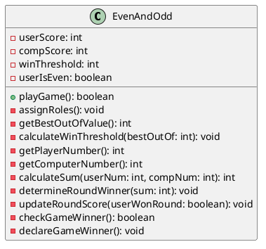

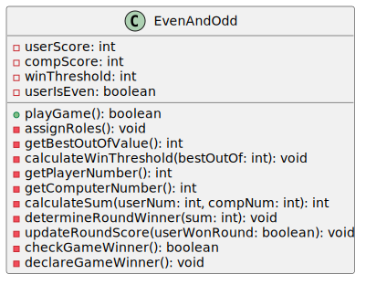

#### Method Glossary

`public boolean` **playGame** `()`
- **return:** boolean, returning true if the user wins.
- **purpose:** Controls the execution loop for Even and Odd.

`private void` **assignRoles** `()`
- **return:** void
- **purpose:** Prompts user for 'E' or 'O' and sets `userIsEven` accordingly.

`private int` **getBestOutOfValue** `()`
- **return:** integer, the best-out-of value.
- **purpose:** Prompts the user for the best-out-of value.

`private void` **calculateWinThreshold** `(int)`
- **param1:** integer, best-out-of value.
- **return:** void
- **purpose:** Sets the required threshold to win.

`private int` **getPlayerNumber** `()`
- **return:** integer, the player's chosen number.
- **purpose:** Prompts the user to pick a number.

`private int` **getComputerNumber** `()`
- **return:** integer, the computer's chosen number.
- **purpose:** Randomly generates the computer's number.

`private int` **calculateSum** `(int, int)`
- **param1:** integer, user's number.
- **param2:** integer, computer's number.
- **return:** integer, the combined sum.
- **purpose:** Computes the combined sum of both numbers.

`private void` **determineRoundWinner** `(int)`
- **param1:** integer, the calculated sum.
- **return:** void
- **purpose:** Uses modulo to determine if the sum is even or odd, compares against roles, and declares the round winner.

`private void` **updateRoundScore** `(boolean)`
- **param1:** boolean, true if user won the round.
- **return:** void
- **purpose:** Increments the scores.

`private boolean` **checkGameWinner** `()`
- **return:** boolean
- **purpose:** Evaluates if the `winThreshold` is met.

`private void` **declareGameWinner** `()`
- **return:** void
- **purpose:** Prints the game winner.

#### Data Configuration Table

| Value & Variable | Input Format | Output Type/Format | Internal Representation |
| --- | --- | --- | --- |
| User role assignment, **userIsEven** | Character 'E' or 'O' | String ("You are even.") | `boolean` |
| Best-out-of rounds, **bestOutOf** | Odd integer | N/A | `int` |
| User selected number, **userNum** | Integer | Displayed in sum equation | `int` |
| Computer generated number, **compNum** | N/A | Displayed in sum equation | `int` |
| Sum of numbers, **sum** | N/A | String equation (e.g., "2 + 4 = 6 is even") | `int` |
| Win threshold limit, **winThreshold** | N/A | N/A | `int` (calculated as `(bestOutOf + 1) / 2`) |
| Round score tracker, **userScore**, **compScore** | N/A | String ("You: [x], Computer: [y]") | `int` |

#### Unit Tests

| **Class/Method** | **Purpose** | **Test Steps** | **Expected Result** | **Actual Result** | **Passed** | **Failed** |
| --- | --- | --- | --- | --- | --- | --- |
| EvenAndOdd/assignRoles | Accepts 'E' and assigns even role to user | Enter "E" | "You are even." Roles assigned; best-out-of prompt displayed | "You are even." Roles assigned; best-out-of prompt displayed | X | |
| EvenAndOdd/assignRoles | Rejects invalid role input | Enter "Evenodd" | "Invalid role. Please try again:" Re-prompted | "Invalid role. Please try again:" Re-prompted | X | |
| EvenAndOdd/getBestOutOfValue | Accepts valid odd best-of value; threshold calculated correctly | Enter "7" | Win threshold set to 4; round 1 begins | Win threshold set to 4; round 1 begins | X | |
| EvenAndOdd/getBestOutOfValue | Rejects invalid best-of value | Enter "20" | "Invalid value. Please try again:" Re-prompted | "Invalid value. Please try again:" Re-prompted | X | |
| EvenAndOdd/getPlayerNumber | Rejects invalid number input | Enter "-1" | "Invalid number. Please try again:" Re-prompted | "Invalid number. Please try again:" Re-prompted | X | |
| EvenAndOdd/determineRoundWinner | Even player wins when sum is even | Set userIsEven=true; call with sum=6 (e.g., 2+4) | "2+4=6 is even, you win this round." Even player score incremented | "2+4=6 is even, you win this round." Even player score incremented | X | |
| EvenAndOdd/determineRoundWinner | Odd player wins when sum is odd | Set userIsEven=false; call with sum=5 (e.g., 3+2) | "3+2=5 is odd, computer wins this round." Odd player score incremented | "3+2=5 is odd, computer wins this round." Odd player score incremented | X | |
| EvenAndOdd/calculateSum | Both numbers and sum are displayed each round | Call calculateSum(3, compNum); verify output | Both numbers and computed sum shown with round winner announced | Both numbers and computed sum shown with round winner announced | X | |
| EvenAndOdd/declareGameWinner | Declares user winner on reaching threshold | Force user to win enough rounds to meet threshold | "You win Even and Odd!" Scoreboard updated | "You win Even and Odd!" Scoreboard updated | X | |
| EvenAndOdd/declareGameWinner | Declares computer winner on reaching threshold | Allow computer to win enough rounds to meet threshold | "The computer wins Even and Odd!" Scoreboard updated | "The computer wins Even and Odd!" Scoreboard updated | X | |

---

### `FindTheRedThread`

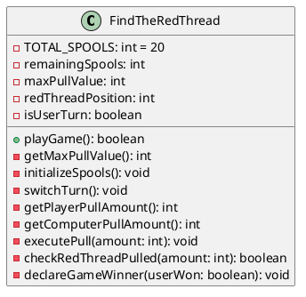

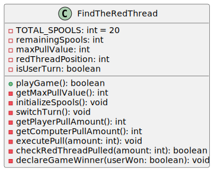

#### Method Glossary

`public boolean` **playGame** `()`
- **return:** boolean, returning true if the user wins.
- **purpose:** Controls the alternating turn loop for Find the Red Thread.

`private int` **getMaxPullValue** `()`
- **return:** integer, the maximum spools allowed per turn.
- **purpose:** Prompts the user to establish the maximum number of spools allowed to be pulled per turn (1–10).

`private void` **initializeSpools** `()`
- **return:** void
- **purpose:** Resets `remainingSpools` to 20 and assigns a random location for the `redThreadPosition`.

`private void` **switchTurn** `()`
- **return:** void
- **purpose:** Toggles the `isUserTurn` boolean.

`private int` **getPlayerPullAmount** `()`
- **return:** integer, the number of spools to pull.
- **purpose:** Prompts the user to specify how many spools to pull.

`private int` **getComputerPullAmount** `()`
- **return:** integer, the computer's pull amount.
- **purpose:** Calculates or randomly generates the computer's pull amount.

`private void` **executePull** `(int)`
- **param1:** integer, the amount of spools pulled.
- **return:** void
- **purpose:** Deducts the pulled amount from `remainingSpools`.

`private boolean` **checkRedThreadPulled** `(int)`
- **param1:** integer, the amount pulled.
- **return:** boolean, true if the pull captured the red thread.
- **purpose:** Checks if the pull action captured the `redThreadPosition`.

`private void` **declareGameWinner** `(boolean)`
- **param1:** boolean, true if the user pulled the thread.
- **return:** void
- **purpose:** Prints the final outcome of the game.

#### Data Configuration Table

| Value & Variable | Input Format | Output Type/Format | Internal Representation |
| --- | --- | --- | --- |
| Max spools per turn, **maxPullValue** | Integer (1–10) | N/A | `int` |
| Red thread location, **redThreadPosition** | N/A | N/A | `int` |
| Spools to pull, **amount** | Integer (1 to maxPullValue) | N/A | `int` |
| Remaining spool count, **remainingSpools** | N/A | Displayed remaining integer | `int` (initialized at 20) |
| Turn indicator, **isUserTurn** | N/A | N/A | `boolean` |

#### Unit Tests

| **Class/Method** | **Purpose** | **Test Steps** | **Expected Result** | **Actual Result** | **Passed** | **Failed** |
| --- | --- | --- | --- | --- | --- | --- |
| FindTheRedThread/getMaxPullValue | Accepts valid max pull value; game initializes with 20 spools | Enter "5" | Game starts with 20 spools; user prompted to pull 1 to 5 | Game starts with 20 spools; user prompted to pull 1 to 5 | X | |
| FindTheRedThread/getMaxPullValue | Rejects max pull value greater than 10 | Enter "11" | "Invalid entry. The value must be between 1 and 10. Please try again:" Re-prompted | "Invalid entry. The value must be between 1 and 10. Please try again:" Re-prompted | X | |
| FindTheRedThread/getMaxPullValue | Rejects max pull value of 0 | Enter "0" | "Invalid entry. The value must be between 1 and [Max pull value]. Please try again:" Re-prompted | "Invalid entry. The value must be between 1 and [Max pull value]. Please try again:" Re-prompted | X | |
| FindTheRedThread/getPlayerPullAmount | Rejects pull amount outside allowed range | Set max=5; enter "7" | "Invalid input. Please enter a number between 1 and 5:" Re-prompted | "Invalid input. Please enter a number between 1 and 5:" Re-prompted | X | |
| FindTheRedThread/getPlayerPullAmount | Rejects pull amount exceeding remaining spools | Set max=10, remainingSpools=3; enter "5" | "Invalid move. You cannot pull more spools than remain:" Re-prompted | "Invalid move. You cannot pull more spools than remain:" Re-prompted | X | |
| FindTheRedThread/getPlayerPullAmount | Rejects non-numeric pull input | Enter "abc" | Error message displayed; re-prompted for a valid number | Error message displayed; re-prompted for a valid number | X | |
| FindTheRedThread/checkRedThreadPulled | Detects user pulling the red thread | Force redThreadPosition within pull range; call checkRedThreadPulled | "You pulled the red thread! You win!" Scoreboard updated | "You pulled the red thread! You win!" Scoreboard updated | X | |
| FindTheRedThread/checkRedThreadPulled | Detects computer pulling the red thread | Force redThreadPosition within computer pull range; call checkRedThreadPulled on computer's turn | "The computer pulled the red thread! The computer wins!" Scoreboard updated | "The computer pulled the red thread! The computer wins!" Scoreboard updated | X | |
| FindTheRedThread/executePull | Remaining spool count decrements correctly after each pull | Set remainingSpools=20; call executePull(3) | 17 spools remain displayed; count continues decreasing each turn | 17 spools remain displayed; count continues decreasing each turn | X | |
| FindTheRedThread/switchTurn | Turns alternate correctly between user and computer | Call switchTurn repeatedly; observe isUserTurn value | Game alternates user → computer → user until red thread is found | Game alternates user → computer → user until red thread is found | X | |

---

## Unified Data Configuration Table

| Class / Method | Value & Variable | Input Format | Output Type/Format | Internal Representation |
| --- | --- | --- | --- | --- |
| PlayGames / displayMainMenu | Main menu selection, **choice** | Integer (1–6) | N/A | `int` |
| PlayGames / displayFinalTally | Overall session scores, **userOverallWins**, **compOverallWins** | N/A | Integer values shown on final tally | `int` |
| FindTheThimble / getBestOutOfValue | Best-out-of rounds, **bestOutOf** | Odd integer | N/A | `int` |
| FindTheThimble / getPlayerGuess | User hand guess, **guess** | Character 'L' or 'R' | N/A | `char` |
| FindTheThimble / hideThimble | Hidden thimble location, **hidden** | N/A | Revealed in text ("Right" / "Left") | `char` ('L' or 'R') |
| CoinFlip / getBestOutOfValue | Best-out-of rounds, **bestOutOf** | Odd integer | N/A | `int` |
| CoinFlip / getPlayerCall | User coin call, **call** | Character 'H' or 'T' | N/A | `char` |
| CoinFlip / flipCoin | Coin flip result, **result** | N/A | String (e.g., "The coin landed on: Heads.") | `char` ('H' or 'T') |
| GuessTheNumber / getRange | Game range bound, **numberRange** | Integer | N/A | `int` |
| GuessTheNumber / getMaxGuesses | Maximum guesses allowed, **maxGuesses** | Integer (≤ half of range) | N/A | `int` |
| GuessTheNumber / generateTargetNumber | Target number, **targetNumber** | N/A | N/A | `int` |
| GuessTheNumber / getPlayerGuess | User's attempt, **guess** | Integer | N/A | `int` |
| GuessTheNumber / evaluateGuess | Guesses remaining, **currentGuessesLeft** | N/A | String (e.g., "Guesses left: 4") | `int` |
| EvenAndOdd / assignRoles | User role assignment, **userIsEven** | Character 'E' or 'O' | String ("You are even.") | `boolean` |
| EvenAndOdd / getBestOutOfValue | Best-out-of rounds, **bestOutOf** | Odd integer | N/A | `int` |
| EvenAndOdd / getPlayerNumber | User selected number, **userNum** | Integer | Displayed in sum equation | `int` |
| EvenAndOdd / getComputerNumber | Computer generated number, **compNum** | N/A | Displayed in sum equation | `int` |
| EvenAndOdd / calculateSum | Sum of numbers, **sum** | N/A | String equation (e.g., "2 + 4 = 6 is even") | `int` |
| FindTheRedThread / getMaxPullValue | Max spools per turn, **maxPullValue** | Integer (1–10) | N/A | `int` |
| FindTheRedThread / initializeSpools | Red thread location, **redThreadPosition** | N/A | N/A | `int` |
| FindTheRedThread / getPlayerPullAmount | Spools to pull, **amount** | Integer (1 to maxPullValue) | N/A | `int` |
| FindTheRedThread / executePull | Remaining spool count, **remainingSpools** | N/A | Displayed remaining integer | `int` (initialized at 20) |
| FindTheRedThread / switchTurn | Turn indicator, **isUserTurn** | N/A | N/A | `boolean` |
| Best-out-of Mini-Games / calculateWinThreshold | Win threshold limit, **winThreshold** | N/A | N/A | `int` (calculated as `(bestOutOf + 1) / 2`) |
| Best-out-of Mini-Games / updateRoundScore | Round score tracker, **userScore**, **compScore** | N/A | String ("You: [x], Computer: [y]") | `int` |