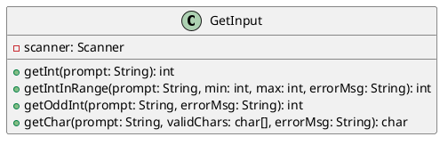
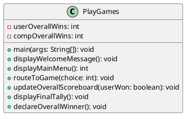
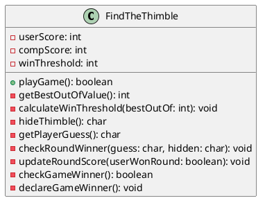
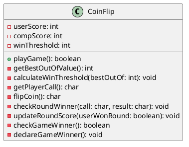
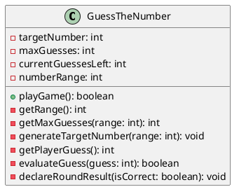
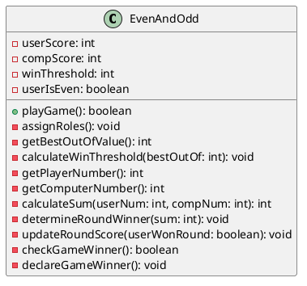
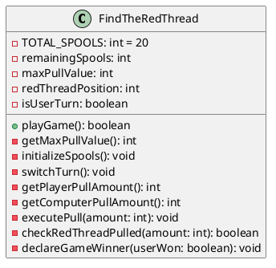

# Code Design
### `GetInput`

### `PlayGames`

### `FindTheThimble`

### `CoinFlip`

### `GuessTheNumber`

### `EvenAndOdd`

### `FindTheRedThread`

#### Method Glossary
**getInt** (String)
* **param1:** String, accepting the prompt to display to the user.
* **return:** integer, representing a valid numeric input.
* **purpose:** Prompts the user for an integer, catches exceptions to prevent crashes, and returns the valid integer.

**getIntInRange** (String, int, int, String)
* **param1:** String, prompt to display to the user.
* **param2:** integer, minimum acceptable value.
* **param3:** integer, maximum acceptable value.
* **param4:** String, error message for invalid input.
* **return:** integer, validated number within bounds.
* **purpose:** Prompts the user for a number, looping until the input falls inclusively between the min and max parameters.

**getOddInt** (String, String)
* **param1:** String, prompt to display to the user.
* **param2:** String, error message.
* **return:** integer, validated odd number.
* **purpose:** Accepts an integer, verifying it is odd, looping if the user provides an even number.

**getChar** (String, char[], String)
* **param1:** String, prompt to display to the user.
* **param2:** char array, specific valid characters allowed.
* **param3:** String, error message.
* **return:** char, validated user selection.
* **purpose:** Prompts the user, reads the character, converts it to uppercase, and validates it against the provided array.

---

### `PlayGames`

#### Method Glossary
**main** (String[])
* **param1:** String array, command line arguments.
* **return:** void
* **purpose:** The primary entry point of the program.

**displayWelcomeMessage** ()
* **return:** void
* **purpose:** Prints the initial "Game of Games" welcome banner to the console.

**displayMainMenu** ()
* **return:** integer, menu choice.
* **purpose:** Displays the 1-6 menu options and returns the user's validated selection.

**routeToGame** (int)
* **param1:** integer, representing the menu selection.
* **return:** void
* **purpose:** Routes the user to the correct mini-game class based on their menu choice.

**updateOverallScoreboard** (boolean)
* **param1:** boolean, indicating if the user won the preceding game.
* **return:** void
* **purpose:** Increments the overall session score and prints the updated tally.

**displayFinalTally** ()
* **return:** void
* **purpose:** Displays the final accumulated scores upon quitting.

**declareOverallWinner** ()
* **return:** void
* **purpose:** Evaluates the final scores and prints the ultimate winner of the session.

---

### `FindTheThimble`

#### Method Glossary
**playGame** ()
* **return:** boolean, returning true if the user wins the game, false if the computer wins.
* **purpose:** Controls the main execution loop for the mini-game.

**getBestOutOfValue** ()
* **return:** integer, the best-out-of value.
* **purpose:** Prompts the user for the odd number of rounds to play.

**calculateWinThreshold** (int)
* **param1:** integer, the best-out-of odd value.
* **return:** void
* **purpose:** Calculates the required wins to end the game `(bestOutOf + 1) / 2`.

**hideThimble** ()
* **return:** char, representing 'L' or 'R'.
* **purpose:** Randomly selects the hand the thimble is hidden in.

**getPlayerGuess** ()
* **return:** char, representing 'L' or 'R'.
* **purpose:** Prompts the user to guess a hand.

**checkRoundWinner** (char, char)
* **param1:** char, the user's guess.
* **param2:** char, the actual hidden location.
* **return:** void
* **purpose:** Compares the parameters, outputs the result, and calls `updateRoundScore`.

**updateRoundScore** (boolean)
* **param1:** boolean, true if the user won the round.
* **return:** void
* **purpose:** Increments the appropriate round score.

**checkGameWinner** ()
* **return:** boolean
* **purpose:** Checks if either player has reached the `winThreshold`.

**declareGameWinner** ()
* **return:** void
* **purpose:** Prints the final winner of the mini-game.

---

### `CoinFlip`

#### Method Glossary
**playGame** ()
* **return:** boolean, returning true if the user wins the game.
* **purpose:** Controls the execution loop for Coin Flip.

**getBestOutOfValue** ()
* **return:** integer, the best-out-of value.
* **purpose:** Prompts the user for the odd number of rounds.

**calculateWinThreshold** (int)
* **param1:** integer, the best-out-of odd value.
* **return:** void
* **purpose:** Calculates the required wins.

**getPlayerCall** ()
* **return:** char, representing 'H' or 'T'.
* **purpose:** Prompts the user to call heads or tails.

**flipCoin** ()
* **return:** char, representing 'H' or 'T'.
* **purpose:** Randomly generates the coin flip result.

**checkRoundWinner** (char, char)
* **param1:** char, the user's call.
* **param2:** char, the flip result.
* **return:** void
* **purpose:** Compares the call to the flip, outputs the result, and calls `updateRoundScore`.

**updateRoundScore** (boolean)
* **param1:** boolean, true if the user won the round.
* **return:** void
* **purpose:** Increments the score.

**checkGameWinner** ()
* **return:** boolean
* **purpose:** Evaluates if the `winThreshold` is met.

**declareGameWinner** ()
* **return:** void
* **purpose:** Prints the game winner.

---

### `GuessTheNumber`

#### Method Glossary
**playGame** ()
* **return:** boolean, returning true if the user wins.
* **purpose:** Controls the execution loop for Guess the Number.

**getRange** ()
* **return:** integer
* **purpose:** Prompts the user to establish the upper bound of the number range.

**getMaxGuesses** (int)
* **param1:** integer, the established range.
* **return:** integer
* **purpose:** Prompts the user for their guess limit, validating it is no more than half the range.

**generateTargetNumber** (int)
* **param1:** integer, the established range.
* **return:** void
* **purpose:** Randomly selects the target number within the range.

**getPlayerGuess** ()
* **return:** integer
* **purpose:** Prompts the user for their current guess.

**evaluateGuess** (int)
* **param1:** integer, the user's guess.
* **return:** boolean
* **purpose:** Compares the guess to the target, returning true if matched, and decrements `currentGuessesLeft` if wrong.

**declareRoundResult** (boolean)
* **param1:** boolean, indicating a correct guess.
* **return:** void
* **purpose:** Prints the win/loss state of the game based on the evaluation.

---

### `EvenAndOdd`

#### Method Glossary
**playGame** ()
* **return:** boolean, returning true if the user wins.
* **purpose:** Controls the execution loop for Even and Odd.

**assignRoles** ()
* **return:** void
* **purpose:** Prompts user for 'E' or 'O' and sets `userIsEven` accordingly.

**getBestOutOfValue** ()
* **return:** integer
* **purpose:** Prompts the user for the best-out-of value.

**calculateWinThreshold** (int)
* **param1:** integer, best-out-of value.
* **return:** void
* **purpose:** Sets the required threshold to win.

**getPlayerNumber** ()
* **return:** integer
* **purpose:** Prompts the user to pick a number.

**getComputerNumber** ()
* **return:** integer
* **purpose:** Randomly generates the computer's number.

**calculateSum** (int, int)
* **param1:** integer, user's number.
* **param2:** integer, computer's number.
* **return:** integer
* **purpose:** Computes the combined sum of both numbers.

**determineRoundWinner** (int)
* **param1:** integer, the calculated sum.
* **return:** void
* **purpose:** Uses modulo to determine if the sum is even or odd, compares against roles, and declares the round winner.

**updateRoundScore** (boolean)
* **param1:** boolean, true if user won round.
* **return:** void
* **purpose:** Increments the scores.

**checkGameWinner** ()
* **return:** boolean
* **purpose:** Evaluates if the `winThreshold` is met.

**declareGameWinner** ()
* **return:** void
* **purpose:** Prints the game winner.

---

### `FindTheRedThread`

#### Method Glossary
**playGame** ()
* **return:** boolean, returning true if the user wins.
* **purpose:** Controls the alternating turn loop for Find the Red Thread.

**getMaxPullValue** ()
* **return:** integer
* **purpose:** Prompts the user to establish the maximum number of spools allowed to be pulled per turn (1-10).

**initializeSpools** ()
* **return:** void
* **purpose:** Resets `remainingSpools` to 20 and assigns a random location for the `redThreadPosition`.

**switchTurn** ()
* **return:** void
* **purpose:** Toggles the `isUserTurn` boolean.

**getPlayerPullAmount** ()
* **return:** integer
* **purpose:** Prompts the user to specify how many spools to pull.

**getComputerPullAmount** ()
* **return:** integer
* **purpose:** Calculates or randomly generates the computer's pull amount.

**executePull** (int)
* **param1:** integer, the amount of spools pulled.
* **return:** void
* **purpose:** Deducts the pulled amount from `remainingSpools`.

**checkRedThreadPulled** (int)
* **param1:** integer, the amount pulled.
* **return:** boolean
* **purpose:** Checks if the pull action captured the `redThreadPosition`.

**declareGameWinner** (boolean)
* **param1:** boolean, true if the user pulled the thread.
* **return:** void
* **purpose:** Prints the final outcome of the game.
