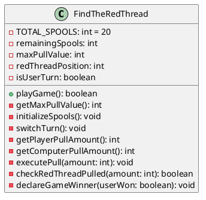

```plantuml
@startuml
class FindTheRedThread {
  - TOTAL_SPOOLS: int = 20
  - remainingSpools: int
  - maxPullValue: int
  - redThreadPosition: int
  - isUserTurn: boolean
  
  + playGame(): boolean
  - getMaxPullValue(): int
  - initializeSpools(): void
  - switchTurn(): void
  - getPlayerPullAmount(): int
  - getComputerPullAmount(): int
  - executePull(amount: int): void
  - checkRedThreadPulled(amount: int): boolean
  - declareGameWinner(userWon: boolean): void
}
@enduml
```