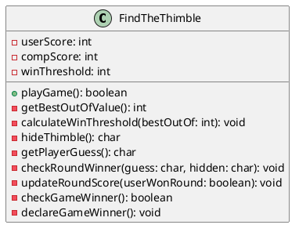

```plantuml
@startuml
class FindTheThimble {
  - userScore: int
  - compScore: int
  - winThreshold: int
  
  + playGame(): boolean
  - getBestOutOfValue(): int
  - calculateWinThreshold(bestOutOf: int): void
  - hideThimble(): char
  - getPlayerGuess(): char
  - checkRoundWinner(guess: char, hidden: char): void
  - updateRoundScore(userWonRound: boolean): void
  - checkGameWinner(): boolean
  - declareGameWinner(): void
}
@enduml
```